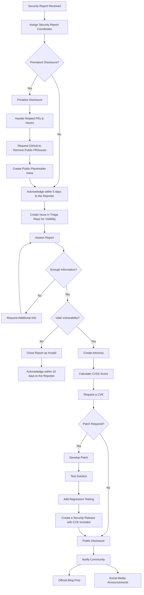

# Security Report Handling Process
**Version:** 1.0  
**Last Updated:** March 2025  
**Maintainers:** Security Triage Team  

## Introduction
Security is a top priority for the Express.js project. This document outlines the **formal process** for handling **security reports**, including how to **triage**, **assess**, and **disclose** vulnerabilities responsibly.

## Scope

The Security Triage Team will use this document as a process guide when a security vulnerability is reported, from triage to resolution. This process must align with the project's [SECURITY policy](https://github.com/expressjs/.github/blob/master/SECURITY.md) and cannot diverge significantly.

## Security Report Handling Flowchart
The following diagram details the **decision-making process** for handling security reports:

## Roles & Responsibilities

### Reporter

This person submits a security report to the Security Triage Team and provides detailed information about the suspected vulnerability. It is expected that the reporter will cooperate with the Security Triage Team during this process and follows responsible disclosure guidelines.

**Responsibilities**
- Submit a security report to the Security Triage Team.

**Expectations**
- Provide detailed information about the suspected vulnerability.
- Follow responsible disclosure guidelines (report privately before public disclosure).
- Cooperate with the security team by providing additional details when needed.
- Test and verify patches (when applicable).
- Respect security timelines and avoid premature public disclosure.

### Security Report Coordinator

This person acts the focal point for an specific security report and ensures the report follows all responsible disclosure guidelines, also coordinates the remediation process if a vulnerability is confirmed.

**Responsibilities**
- Acknowledge receipt of security reports within the required timeframe.
- Assign an Analyst to assess and validate the report.
- Ensure communication with the reporter throughout the process.
- Coordinate the remediation process if a vulnerability is confirmed.
- Oversee the advisory & CVE request process if applicable.
- Escalate critical vulnerabilities when necessary.
- Track all security reports for visibility and reporting.

**Requirements**
- Must be a member of the Security Triage Team.

### Security Analyst

**Responsibilities**
- Assess the security report and determine its severity.
- Validate the reported vulnerability against best practices.
- Identify potential mitigation strategies.
- Prepare a report for the Security Report Coordinator.

### Remediation Developer

**Responsibilities**
- Develop a patch or solution based on the reported vulnerability.
- Ensure the patch follows best practices and is testable.
- Test the patch to ensure it works as expected.
- Create a pull request to merge the patch into the project.

