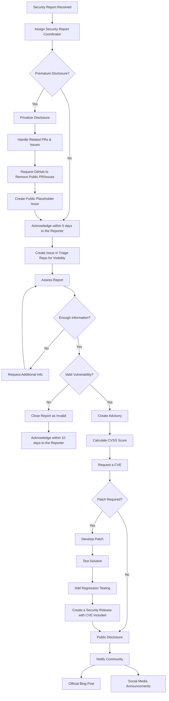

# Security Report Handling Process
**Version:** 1.0  
**Last Updated:** March 2025  
**Maintainers:** Security Triage Team  

## Introduction
Security is a top priority for the Express.js project. This document outlines the **formal process** for handling **security reports**, including how to **triage**, **assess**, and **disclose** vulnerabilities responsibly.

## Scope

The Security Triage Team will use this document as a process guide when a security vulnerability is reported, from triage to resolution. This process must align with the project's [SECURITY policy](https://github.com/expressjs/.github/blob/master/SECURITY.md) and cannot diverge significantly.

## Security Report Handling Flowchart
The following diagram details the **decision-making process** for handling security reports:

