# Scorecard Handling and Review Process  
**Version:** 1.0  
**Last Updated:** June 2025  
**Maintainers:** Express.js Security WG  

---

## Introduction

This document defines the formal process for handling and reviewing the OpenSSF Scorecard reports in the Express.js organization. The process ensures continuous monitoring of the security posture of our repositories and encourages action when reasonable improvements can be made.

## Scope

This process applies to all repositories listed under [packages in scope](../docs/packages-in-scope.md), which defines the minimum required scope for Scorecard monitoring by the Security WG. Additional repositories may be monitored at the discretion of the team but are not required.

The process is managed and executed by the [Security WG](../README.md#team-members-expressjssecurity-wg).

---

## Scorecard Monitoring Flowchart

```mermaid
flowchart TD
    A[Scorecard Job Runs — Scheduled or Manual] --> B[Automation Generates Report & PR]
    B --> C[Issue Created with Summary]
    C --> D[Review Deltas Against Previous Report]

    D --> E{Any Significant Regression or Warning?}

    E -- No --> G[Mark Issue as Reviewed — No Action Needed]

    E -- Yes --> F[Determine Actionability]
    F --> H{Action Required?}

    H -- No --> G
    H -- Yes --> I[File Follow-up Issue or PR in Affected Repo]
    I --> J[Track Status in Security WG]

    G --> K[Close Scorecard Tracking Issue]
    J --> K

```

## Automation Overview

The [OpenSSF Scorecard Monitor](https://github.com/ossf/scorecard-monitor) GitHub Action is configured to run in the `security-wg` repository on a biweekly schedule ([ref](../.github/workflows/ossf-scorecard-reporting.yml)) (every Sunday at 00:00 UTC) and can also be triggered manually via the GitHub UI.

This workflow does not perform Scorecard scans directly. Instead, it collects and aggregates results from participating repositories within the Express.js GitHub organizations that proactively report their own Scorecard data to the OSSF Scorecard API.

The workflow performs the following:

- Discovers repositories to include in the report using the config at `tools/ossf_scorecard/scope.json`.
- Collects previously generated Scorecard metadata from those repositories.
- Aggregates the results into:
  - A Scorecard database: `tools/ossf_scorecard/database.json`.
  - A human-readable Markdown report: `tools/ossf_scorecard/report.md`.
- Creates a GitHub issue with a summary of the findings.
- Opens a GitHub Pull Request with updated files.

Example artifacts:
- PR: [OpenSSF Scorecard Report updated (PR #69)](https://github.com/expressjs/security-wg/pull/69).
- Issue: [OpenSSF Scorecard Report updated! (Issue #68)](https://github.com/expressjs/security-wg/issues/68).

> [!NOTE]  
> 🔧 Participating repositories must individually configure and run `ossf/scorecard` as a scheduled workflow to generate up-to-date results. The monitor workflow does not perform scans itself — it only collects and aggregates existing reports.

> [!TIP]  
> You can close the issue when merging the PR using [GitHub linking](https://docs.github.com/en/issues/tracking-your-work-with-issues/using-issues/linking-a-pull-request-to-an-issue) capabilities

## Responsibilities

The Security WG is responsible for reviewing the OSSF Scorecard reports and assessing the relevance and severity of changes.

**Responsibilities**
- Compare score changes with previous results
- Evaluate whether recommendations are relevant, actionable, and within policy
- Recommend and/or implement improvements if necessary
- Record the review outcome in the tracking issue

## Runbook

### Step 0: Trigger & Report Generation

The Scorecard job runs on a scheduled basis (every 2 weeks) or can be manually triggered. This generates:

- Updated results in `tools/ossf_scorecard`
- A PR with the updated data
- A tracking issue for discussion

> [!WARNING]  
> The job runs against repositories listed in [`packages-in-scope.md`](https://github.com/expressjs/security-wg/blob/main/docs/packages-in-scope.md). If additional repos are monitored, results may include those as well.

### Step 1: Review Scorecard Deltas

Reviewers should analyze the changes in Scorecard results between the current and previous reports, with particular attention to:

- **Significant regressions** — such as a drop in high-priority checks like `Branch-Protection`, `Token-Permissions`, or `Maintained`.
- **New warnings or failures** — especially in checks that were previously passing.
- **Improvements** — even when a check has improved, reviewers should determine whether follow-up action is still required (e.g., enabling a security control that remains optional).

> [!TIP]
> The Scorecard Monitor report includes links to [ossf/scorecard-visualizer](https://github.com/ossf/scorecard-visualizer), which you can use to visually compare results between two repository commit hashes.

### Step 2: Determine Relevance and Policy Alignment

Not all Scorecard recommendations apply equally across Express repositories. For example:

- **Action Pinning:** The organization follows its own policy as documented in [ADR 366](https://github.com/expressjs/discussions/blob/master/docs/adr/366-action-pinning.md)
- **Token Permissions:** Some recommendations may not align with our workflow model

When encountering a new or changed recommendation:
- Refer to relevant ADRs or internal policies
- Use team judgment to assess whether a change is actionable and necessary

### Step 3: Take Action or Acknowledge

If a change requires action:
- File a follow-up issue or PR in the affected repository
- Optionally, reference the Scorecard tracking issue for context

If no action is needed:
- Comment in the issue that the change was reviewed and no further work is planned

Once the PR is merged and review is complete:
- Close the tracking issue

## Notes & Best Practices

- Scorecard monitoring is not a compliance checklist — it is a decision-making tool.  
- Document exceptions and decisions clearly in the tracking issues.
- If a recommendation recurs or spreads across multiple repositories, consider an ADR or organization-wide policy update.
